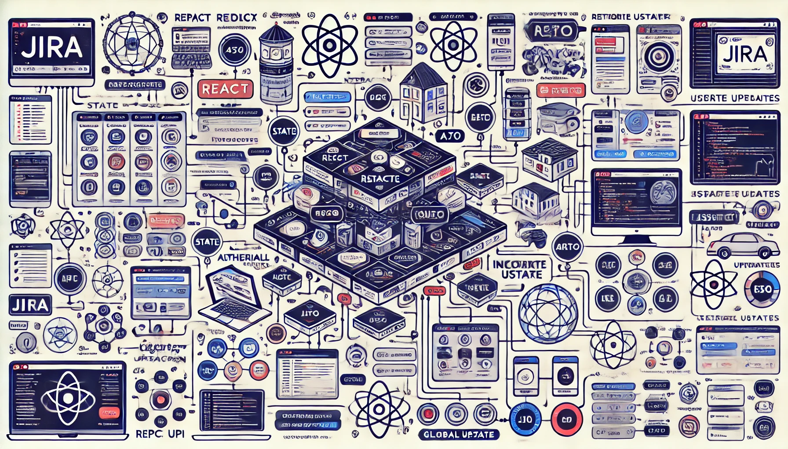

## Jira Frontend High Level Design

### Functional Requirements
1. **User Authentication**: Users should be able to sign up, log in, and log out.
2. **Dashboard**: Display a summary of user activities, projects, and tasks.
3. **Project Management**: Create, update, and delete projects.
4. **Issue Tracking**: Create, update, assign, and track issues within projects.
5. **Search and Filter**: Users should be able to search and filter issues and projects.
6. **Notifications**: Real-time notifications for issue updates, assignments, and comments.
7. **User Roles and Permissions**: Different roles with specific permissions (e.g., Admin, Developer, Viewer).

### Non-Functional Requirements
1. **Performance**: The application should load within 3 seconds for the user.
2. **Scalability**: The system should handle up to 10,000 concurrent users.
3. **Security**: Implement HTTPS, data encryption, and secure authentication mechanisms.
4. **Usability**: The interface should be intuitive and easy to navigate.
5. **Reliability**: The system should have 99.9% uptime.
6. **Maintainability**: The codebase should be modular and well-documented to facilitate maintenance and updates.
7. **Compatibility**: The application should be compatible with the latest versions of major browsers (Chrome, Firefox, Safari, Edge).

### High Level Frontend Design for Project Management Screen

The Project Management screen is a crucial part of the Jira frontend. It allows users to create, update, and delete projects, as well as view details of existing projects. Below are the key components and their functionalities:

1. **Header**: 
  - Contains the project title and a navigation menu.
  - Includes buttons for creating a new project and accessing user settings.

2. **Project List**:
  - Displays a list of all projects with basic details such as project name, description, and status.
  - Each project item is clickable and leads to the project details view.

3. **Project Details View**:
  - Shows detailed information about the selected project, including project name, description, status, start date, end date, and team members.
  - Includes tabs for navigating between different sections such as Overview, Issues, and Settings.

4. **Create/Edit Project Modal**:
  - A modal dialog for creating a new project or editing an existing project.
  - Contains form fields for entering project details such as name, description, start date, end date, and assigning team members.
  - Includes buttons for saving changes or canceling the operation.

5. **Search and Filter Bar**:
  - Allows users to search for projects by name or filter projects based on status, date range, or team members.

6. **Notifications Panel**:
  - Displays real-time notifications related to project updates, such as new issues created, status changes, or comments added.

7. **Footer**:
  - Contains links to help, support, and other relevant resources.

The design should be responsive and ensure a seamless user experience across different devices and screen sizes.

